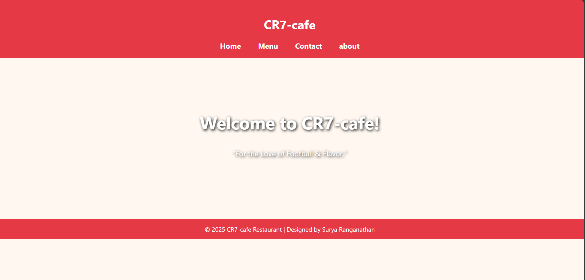
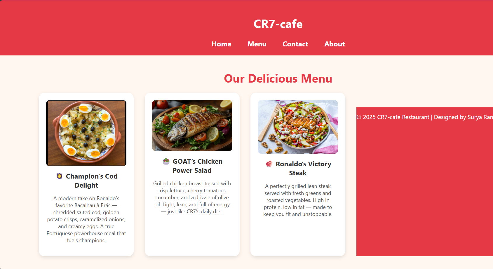

# Ex.07 Restaurant Website
# Date:06/10/2025
# AIM:
To develop a static Restaurant website to display the food items and services provided by them.

# DESIGN STEPS:
## Step 1:
Requirement collection.

## Step 2:
Creating the layout using HTML and CSS.

## Step 3:
Updating the sample content.

## Step 4:
Choose the appropriate style and color scheme.

## Step 5:
Validate the layout in various browsers.

## Step 6:
Validate the HTML code.

## Step 7:
Publish the website in the given URL.

# PROGRAM:
```
index.html
<!DOCTYPE html>
<html lang="en">
<head>
  <meta charset="UTF-8" />
  <meta name="viewport" content="width=device-width, initial-scale=1.0" />
  <title>CR7-cafe</title>
  <style>
    body {
      margin: 0;
      font-family: "Segoe UI", Tahoma, Geneva, Verdana, sans-serif;
      background-color: #fff7f0;
      color: #333;
      text-align: center;
    }
    header {
      background-color: #e63946;
      color: white;
      padding: 20px 0;
    }
    nav a {
      text-decoration: none;
      color: white;
      margin: 0 20px;
      font-weight: bold;
      font-size: 1.2rem;
    }
    nav a:hover {
      color: #ffd166;
    }
    .hero {
      background-image: url('https://images.unsplash.com/photo-1600891963933-960d8b782e93');
      background-size: cover;
      background-position: center;
      color: white;
      padding: 100px 20px;
      text-shadow: 2px 2px 8px #000;
    }
    .hero h2 {
      font-size: 2.8rem;
    }
    .hero p {
      font-size: 1.2rem;
    }
    footer {
      background-color: #e63946;
      color: white;
      padding: 15px 0;
      font-size: 1rem;
      margin-top: 40px;
    }
  </style>
</head>

<body>
  <header>
    <h1>CR7-cafe</h1>
    <nav>
      <a href="index.html">Home</a>
      <a href="menu.html">Menu</a>
      <a href="contact.html">Contact</a>
      <a href="about.html">about</a>
    </nav>
  </header>

  <section class="hero">
    <h2>Welcome to CR7-cafe!</h2>
    <p>“For the Love of Football & Flavor.”</p>
  </section>

  <footer>
    © 2025 CR7-cafe Restaurant | Designed by Surya Ranganathan
  </footer>
</body>
</html>

menu.html
<!DOCTYPE html>
<html lang="en">
<head>
  <meta charset="UTF-8" />
  <meta name="viewport" content="width=device-width, initial-scale=1.0" />
  <title>CR7-cafe Menu</title>
  <style>
    body {
      margin: 0;
      font-family: "Segoe UI", Tahoma, Geneva, Verdana, sans-serif;
      background-color: #fff7f0;
      color: #333;
      text-align: center;
    }
    header {
      background-color: #e63946;
      color: white;
      padding: 20px 0;
    }
    nav a {
      text-decoration: none;
      color: white;
      margin: 0 20px;
      font-weight: bold;
      font-size: 1.2rem;
    }
    nav a:hover {
      color: #ffd166;
    }
    h2 {
      color: #e63946;
      margin: 40px 0 20px;
      font-size: 2rem;
    }
    .menu-items {
      display: flex;
      flex-wrap: wrap;
      justify-content: center;
      gap: 30px;
      padding: 0 20px;
    }
    .item {
      background-color: white;
      border-radius: 15px;
      box-shadow: 0 4px 10px rgba(0,0,0,0.1);
      width: 220px;
      padding: 20px;
      transition: transform 0.3s;
    }
    .item:hover {
      transform: scale(1.05);
    }
    .item img {
      width: 100%;
      border-radius: 10px;
    }
    .item h3 {
      margin: 10px 0 5px;
      color: #333;
    }
    .item p {
      color: #555;
      font-size: 0.9rem;
    }
    footer {
      background-color: #e63946;
      color: white;
      padding: 15px 0;
      font-size: 1rem;
      margin-top: 40px;
    }
  </style>
</head>

<body>
  <header>
    <h1>CR7-cafe</h1>
    <nav>
      <a href="index.html">Home</a>
      <a href="menu.html">Menu</a>
      <a href="contact.html">Contact</a>
      <a href="about.html">About</a>
    </nav>
  </header>

  <h2>Our Delicious Menu</h2>

  <div class="menu-items">
    <div class="item">
      
      <h3>🥘 Champion’s Cod Delight</h3>
      <p>A modern take on Ronaldo’s favorite Bacalhau à Brás — shredded salted cod, golden potato crisps, caramelized onions, and creamy eggs. A true Portuguese powerhouse meal that fuels champions.</p>
    </div>

    <div class="item">
      
      <h3>🥗 GOAT’s Chicken Power Salad</h3>
      <p>Grilled chicken breast tossed with crisp lettuce, cherry tomatoes, cucumber, and a drizzle of olive oil. Light, lean, and full of energy — just like CR7’s daily diet.</p>
    </div>

    <div class="item">
      
      <h3>🥩 Ronaldo’s Victory Steak</h3>
      <p>A perfectly grilled lean steak served with fresh greens and roasted vegetables. High in protein, low in fat — made to keep you fit and unstoppable.</p>
    </div>

  
  <footer>
    © 2025 CR7-cafe Restaurant | Designed by Surya Ranganathan
  </footer>
</body>
</html>

contact.html
<!DOCTYPE html>
<html lang="en">
<head>
  <meta charset="UTF-8" />
  <meta name="viewport" content="width=device-width, initial-scale=1.0" />
  <title>Contact CR7-cafe</title>
  <style>
    body {
      margin: 0;
      font-family: "Segoe UI", Tahoma, Geneva, Verdana, sans-serif;
      background-color: #fff7f0;
      color: #333;
      text-align: center;
    }
    header {
      background-color: #e63946;
      color: white;
      padding: 20px 0;
    }
    nav a {
      text-decoration: none;
      color: white;
      margin: 0 20px;
      font-weight: bold;
      font-size: 1.2rem;
    }
    nav a:hover {
      color: #ffd166;
    }
    h2 {
      color: #e63946;
      margin-top: 40px;
      font-size: 2rem;
    }
    .contact-info {
      background-color: #f1faee;
      margin: 40px auto;
      width: 80%;
      max-width: 500px;
      border-radius: 15px;
      padding: 30px;
      box-shadow: 0 4px 10px rgba(0,0,0,0.1);
      font-size: 1.1rem;
      line-height: 1.8;
    }
    footer {
      background-color: #e63946;
      color: white;
      padding: 15px 0;
      font-size: 1rem;
      margin-top: 40px;
    }
  </style>
</head>

<body>
  <header>
    <h1>CR7-cafe</h1>
    <nav>
      <a href="index.html">Home</a>
      <a href="menu.html">Menu</a>
      <a href="contact.html">Contact</a>
      <a href="about.html">About</a>
    </nav>
  </header>

  <h2>Contact Us</h2>

  <div class="contact-info">
    📍 123 Flavor Street, Chennai, India <br>
    ☎️ +91 98765 43210 <br>
    ✉️ CR7-cafe@gmail.com <br><br>
    ⏰ Working Hours: 10:00 AM - 10:00 PM
  </div>

  <footer>
    © 2025 CR7-cafe Restaurant | Designed by Surya Ranganathan
  </footer>
</body>
</html>

about.html
<!DOCTYPE html>
<html lang="en">
<head>
  <meta charset="UTF-8" />
  <meta name="viewport" content="width=device-width, initial-scale=1.0" />
  <title>About CR7-cafe</title>

  <style>
    body {
      margin: 0;
      font-family: "Segoe UI", Tahoma, Geneva, Verdana, sans-serif;
      background-color: #fff7f0;
      color: #333;
      text-align: center;
    }

    header {
      background-color: #e63946;
      color: white;
      padding: 20px 0;
    }

    nav a {
      text-decoration: none;
      color: white;
      margin: 0 20px;
      font-weight: bold;
      font-size: 1.2rem;
    }

    nav a:hover {
      color: #ffd166;
    }

    h2 {
      color: #e63946;
      margin-top: 40px;
      font-size: 2rem;
    }

    .about-section {
      width: 80%;
      margin: 30px auto;
      line-height: 1.8;
      font-size: 1.1rem;
      background-color: #f1faee;
      padding: 25px;
      border-radius: 15px;
      box-shadow: 0 4px 10px rgba(0,0,0,0.1);
    }

    .team {
      margin: 40px 0;
    }

    .team-members {
      display: flex;
      flex-wrap: wrap;
      justify-content: center;
      gap: 30px;
      padding: 20px;
    }
    .member {
      background-color: white;
      border-radius: 15px;
      box-shadow: 0 4px 10px rgba(0,0,0,0.1);
      width: 200px;
      padding: 20px;
      transition: transform 0.3s;
    }
  </style>

<body>
 <header>
    <h1>CR7-cafe</h1>
    <nav>
      <a href="index.html">Home</a>
      <a href="menu.html">Menu</a>
      <a href="contact.html">Contact</a>
      <a href="about.html">About</a>
    </nav>
  </header>

  <h2>about us</h2>

  <div class="about us-info">
    At CR7 Café, every flavor celebrates the passion, discipline, and greatness of football legend Cristiano Ronaldo. More than just a café, we’re a tribute to the champion’s lifestyle — a blend of energy, excellence, and taste.
  </div>
  <footer>
    © 2025 CR7-cafe Restaurant | Designed by Surya Ranganathan
  </footer>
</body>
</html>


```
# OUTPUT:


.png>)
.png>)
# RESULT:
The program for designing software company website using HTML and CSS is completed successfully.
